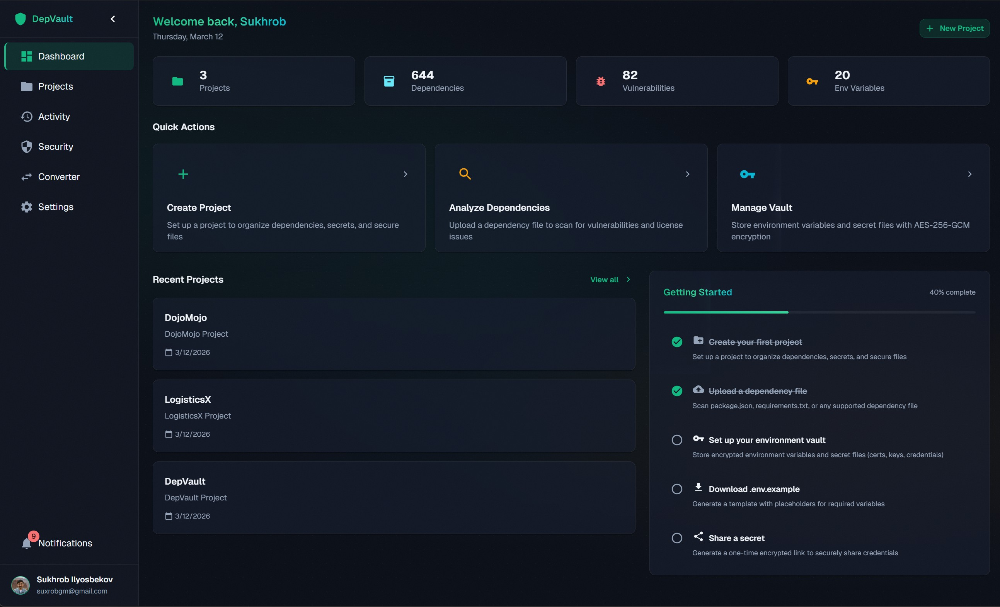
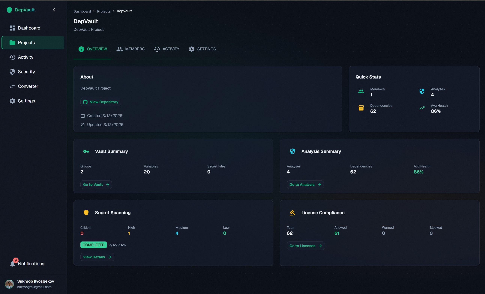
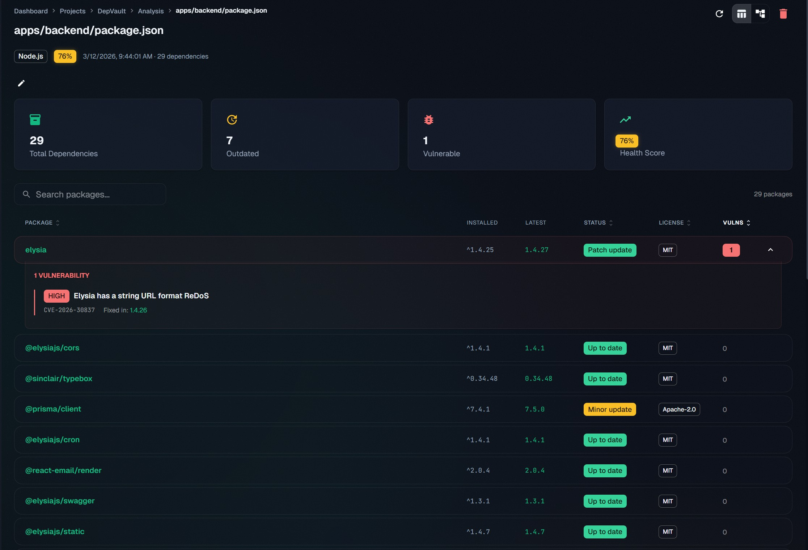
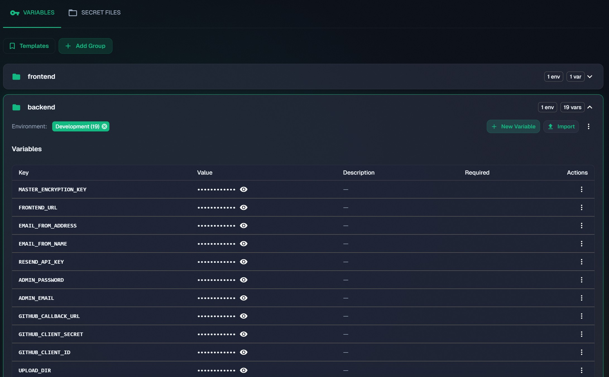
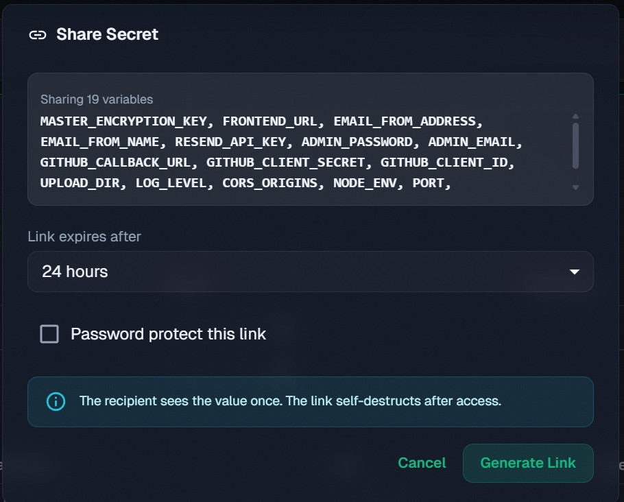
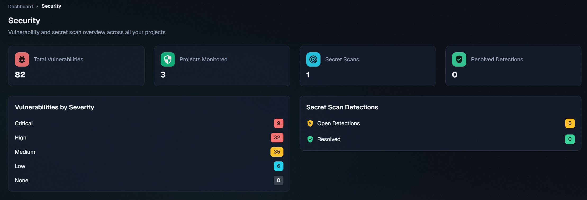
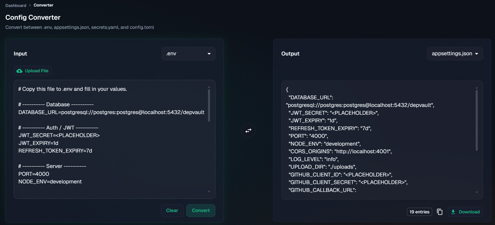

<p align="center">
  
</p>

<h1 align="center">DepVault</h1>

<p align="center">
  <strong>Analyze dependencies. Encrypt secrets. Ship with confidence.</strong>
</p>

<p align="center">
  <a href="https://github.com/suxrobGM/depvault/actions/workflows/ci.yml"></a>
  <a href="https://github.com/suxrobGM/depvault/actions/workflows/deploy.yml"></a>
  <a href="https://depvault.com"></a>
  <a href="https://github.com/suxrobGM/depvault/blob/main/LICENSE"></a>
</p>

<p align="center">
  
  
  
  
  
  
  
</p>

---

DepVault is a full-stack web platform that scans dependencies across 8+ language ecosystems, detects vulnerabilities via OSV.dev, and provides an AES-256-GCM encrypted vault for environment variables and secret files - all from a single dashboard.

> **Live at [depvault.com](https://depvault.com)** | **[Documentation](https://depvault.com/docs)** | **[API Docs (Swagger)](https://depvault.com/api/swagger)**

---

## Key Features

### Dependency Analysis

- Parse dependency files from **8+ ecosystems**: Node.js, Python, .NET, Rust, Go, Java/Kotlin, Ruby, PHP
- Detect outdated packages, known CVEs (via OSV.dev), and license conflicts
- Version comparison with latest available releases
- Support for 8+ config formats: `.env`, `appsettings.json`, `secrets.yaml`, `values.yaml`, and more

### Encrypted Vault

- **AES-256-GCM** encrypted storage for environment variables and secret files
- Environment isolation (development, staging, production) with diff view
- Version history with append-only audit trail
- Support for SSL certificates, private keys, keystores, and provisioning profiles

### Secret Sharing & CI/CD

- One-time encrypted links with auto-expiration and optional password protection
- CI/CD token generation for pipeline secret injection at build time
- Scoped, short-lived tokens - no `.env` files in CI

### Security & Compliance

- Git secret scanning with built-in and custom regex patterns
- License compliance checking with configurable allow/warn/block policies
- Role-based access control (owner, editor, viewer)
- Activity audit logs for all vault operations

### Developer Tools

- Config format converter (`.env` ↔ JSON ↔ YAML ↔ TOML)
- Environment templates for bootstrapping new stages
- Onboarding checklist for new team members
- Secret file bundler - download encrypted archives with one-time passwords

---

## Screenshots

<table>
  <tr>
    <td align="center"><strong>Project Overview</strong></td>
    <td align="center"><strong>Dependency Analysis</strong></td>
  </tr>
  <tr>
    <td></td>
    <td></td>
  </tr>
  <tr>
    <td align="center"><strong>Environment Vault</strong></td>
    <td align="center"><strong>Secret Sharing</strong></td>
  </tr>
  <tr>
    <td></td>
    <td></td>
  </tr>
  <tr>
    <td align="center"><strong>Security Dashboard</strong></td>
    <td align="center"><strong>Config Converter</strong></td>
  </tr>
  <tr>
    <td></td>
    <td></td>
  </tr>
</table>

> See the [full screenshot gallery](docs/screenshots.md) for all features.

---

## Architecture

```text
depvault/
├── apps/
│   ├── backend/         # Elysia REST API (port 4000)
│   ├── frontend/        # Next.js web app (port 4001)
│   ├── cli/             # .NET 10 AOT CLI
│   └── docs/            # Nextra 4 documentation site
├── packages/
│   └── shared/          # Shared types, API client, utilities
├── deploy/              # Docker Compose, Nginx config
└── docs/                # Documentation package
```

| Layer      | Technology              | Why                                                |
| ---------- | ----------------------- | -------------------------------------------------- |
| Runtime    | Bun 1.3+                | Native TypeScript, fast package management         |
| Backend    | Elysia.js               | End-to-end type safety with TypeBox + Eden Treaty  |
| Frontend   | Next.js 16 + React 19   | Server components by default, React compiler       |
| UI         | MUI 7                   | Comprehensive component library, dark theme        |
| Database   | PostgreSQL + Prisma 7   | Multi-file schema, driver adapter for pg           |
| DI         | tsyringe                | Decorator-based dependency injection               |
| Auth       | JWT + GitHub OAuth      | httpOnly cookie storage, no localStorage           |
| Encryption | AES-256-GCM             | Authenticated encryption for vault data            |
| CLI        | .NET 10 (Native AOT)    | Single-file native binary with gzip compression    |
| Docs       | Nextra 4                | Developer and user documentation site              |
| CI/CD      | GitHub Actions + Docker | Multi-stage builds, GHCR, automated VPS deployment |

> For a deeper dive, see the [Architecture Guide](docs/architecture.md).

---

## Security

- **Encryption at rest**: All secret values and files encrypted with AES-256-GCM before database storage
- **Auth**: JWT tokens stored in httpOnly cookies (not localStorage), with refresh token rotation
- **RBAC**: Project-level roles - owner, editor, viewer - enforced on every API endpoint
- **Secret scanning**: Gitleaks integrated in CI pipeline; in-app scanning with custom regex patterns
- **One-time links**: Cryptographically random tokens; content auto-deleted after first access
- **Password hashing**: bcrypt with configurable salt rounds
- **Rate limiting**: Auth endpoints rate-limited to prevent brute-force attacks

---

## CI/CD Pipeline

Two GitHub Actions workflows power the delivery pipeline:

**CI** (`ci.yml`) - runs on every push and PR:

- Format check (Prettier) → Typecheck (backend + frontend) → Unit tests → Build (frontend + CLI) → Secret scanning (Gitleaks) → Dependency audit

**Deploy** (`deploy.yml`) - runs on push to `prod`:

- Build Docker images (backend + frontend) in parallel → Push to GitHub Container Registry → Deploy to VPS via SSH → Health check verification

Both workflows use Bun with dependency caching for fast execution. The CI pipeline also sets up .NET 10 SDK to build the CLI project.

---

## Getting Started

### Prerequisites

- [Bun](https://bun.sh) v1.3+
- [PostgreSQL 18+](https://www.postgresql.org/download)
- [.NET 10 SDK](https://dotnet.microsoft.com/download) (for CLI development)

### Setup

```bash
# Clone the repository
git clone https://github.com/suxrobgm/depvault.git
cd depvault

# Install dependencies
bun install

# Set up environment variables
cp apps/backend/.env.example apps/backend/.env
cp apps/frontend/.env.example apps/frontend/.env
# Edit both .env files with your values

# Generate Prisma client and apply migrations
cd apps/backend
bun run db:generate
bun run db:migrate:apply
bun run db:seed
```

### Development

```bash
# Backend (from apps/backend/)
bun run dev              # Start dev server with watch mode
bun run typecheck        # Type check
bun test                 # Run tests
bun test --coverage      # Run tests with coverage

# Frontend (from apps/frontend/)
bun run dev              # Start Next.js dev server
bun run typecheck        # Type check
bun run lint             # Run ESLint
```

### Database Commands

```bash
# From apps/backend/
bun run db:generate        # Regenerate Prisma client after schema changes
bun run db:migrate         # Create a new migration file
bun run db:migrate:apply   # Apply pending migrations
bun run db:seed            # Seed the database
```

### Building

```bash
# Frontend
cd apps/frontend && bun run build

# Backend
cd apps/backend
bun run build:linux    # Linux binary
bun run build:win      # Windows binary

# CLI (from apps/cli/)
dotnet publish -c Release    # Native AOT binary
```

---

## Documentation

**User & developer docs**: [depvault.com/docs](https://depvault.com/docs) — getting started, user guides, API reference, CLI reference.

**Internal project docs** are in the [`docs/`](docs/README.md) folder:

- [Product Requirements Document](docs/prd.md)
- [Architecture Guide](docs/architecture.md)
- [Deployment Guide](docs/deployment-guide.md)
- [Screenshots Gallery](docs/screenshots.md)
- [UI Mockups](docs/ui-mockups.md)
- [Technical Blog Post](docs/blog-post.md)

---

## License

This project is licensed under the MIT License - see the [LICENSE](LICENSE) file for details.
