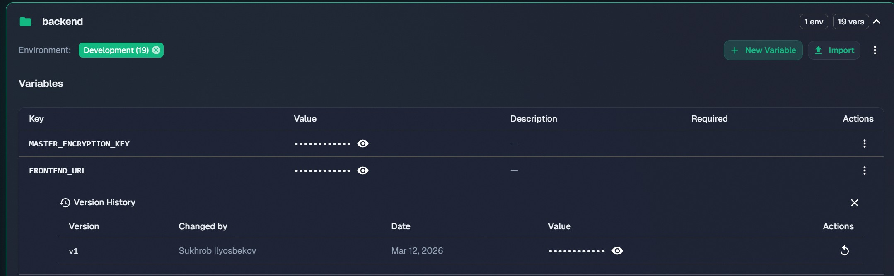
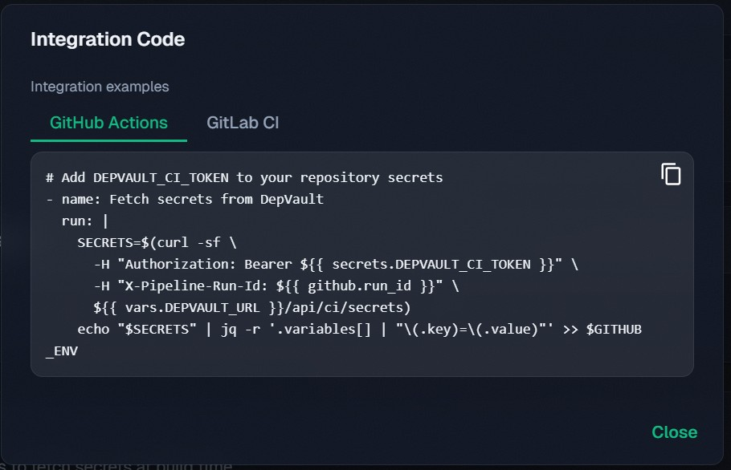
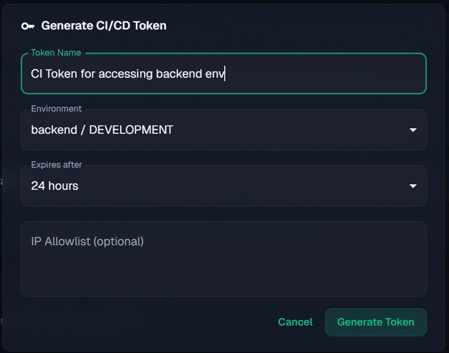

# Building DepVault: A Full-Stack Security Platform with Bun, Elysia, and Next.js 16

If you've ever worked on a team where `.env` files get passed around in Slack DMs, or you've had to run `npm audit`, `pip-audit`, and `dotnet list package --vulnerable` separately across three different repos just to get a picture of your dependency health — you know the pain. There's no single dashboard that handles dependency analysis _and_ secret management across language ecosystems.

That's what DepVault is. I built it as a class project, but I built it to solve a real problem I kept running into. It's a web dashboard that analyzes dependencies across 8+ ecosystems (Node.js, Python, .NET, Go, Rust, Java, PHP, Ruby), detects known vulnerabilities via the OSV.dev database, and gives you an AES-256-GCM encrypted vault for environment variables and secret files. One tool, one login, every stack.

The live app is at [depvault.suxrobgm.net](https://depvault.suxrobgm.net) and the source is on [GitHub](https://github.com/suxrobGM/depvault).

## Architecture

The project is a monorepo with three workspaces: `apps/backend` (Elysia REST API), `apps/frontend` (Next.js web app), and `packages/shared` (shared TypeScript types and utilities). Here's why I picked each piece of the stack.

**Bun** as the runtime was an easy call. Dependency installs are roughly 3x faster than npm, and it runs TypeScript natively — no transpilation step, no `ts-node`, no `tsx` wrapper. For a monorepo with two apps and a shared package, that speed adds up fast during development and CI.

**Elysia.js** is the backend framework, and the main reason I chose it over Express or Fastify is TypeBox. Every request body, query parameter, and response shape is defined as a TypeBox schema, which means the validation and the TypeScript types come from the same source. Better yet, Elysia's Eden Treaty can generate a fully typed API client from those backend types. If I change a response shape in the backend, the frontend lights up with type errors immediately. No OpenAPI codegen step, no drift between docs and code.

**Next.js 16 with React 19** handles the frontend. Server components are the default, which keeps the client bundle small — only interactive pieces get shipped to the browser. React 19's compiler handles memoization automatically, so I could stop sprinkling `useCallback` and `useMemo` everywhere and just write straightforward components. MUI 7 provides the component library.

**Prisma 7** manages the database layer against PostgreSQL. The multi-file schema feature lets me split models by domain (`auth.prisma`, `projects.prisma`, `vault.prisma`) instead of stuffing everything into one 500-line file. I use the `@prisma/adapter-pg` driver adapter for connection management.

**tsyringe** gives me decorator-based dependency injection. Services are marked `@singleton()`, controllers resolve them via `container.resolve()`, and in tests I can swap in mocked dependencies without any gymnastics.

## Key Features

### Dependency Analysis

You upload a dependency file — `package.json`, `requirements.txt`, `go.mod`, `Cargo.toml`, whatever — and DepVault parses it, resolves version information against the relevant package registry, and cross-references every dependency against the OSV.dev vulnerability database. The result is a table showing each dependency with its current version, latest available version, and any known CVEs.

The parsers handle ecosystem-specific quirks: npm's version ranges (`^1.2.3` vs `~1.2.3`), Python's PEP 440 specifiers, Go's module paths with major version suffixes. Each parser is its own module with dedicated tests covering valid input, malformed files, and edge cases.

### Encrypted Environment Vault

Every project gets an encrypted vault where you can store environment variables per environment (development, staging, production). Values are encrypted with AES-256-GCM before they ever hit the database. The vault supports version history so you can see what changed and when, with a diff view for comparing environments.

### Secret Sharing

Need to share a database password with a teammate? Instead of pasting it in Slack, generate a one-time encrypted link. The recipient opens it, sees the value, and the content is permanently deleted from the database after that first access. Links also auto-expire after a configurable time window.

Beyond these three core features, the platform also supports CI/CD token generation for automated access, secret scanning powered by Gitleaks patterns, a format converter between `.env` / JSON / YAML / TOML, and license compliance tracking across dependencies.

## Security

I want to be specific here because "we encrypt everything" is easy to say and means nothing without details.

**Encryption at rest:** Every environment variable value is encrypted with AES-256-GCM. Each value gets its own randomly generated initialization vector (IV), and the authentication tag is stored alongside the ciphertext. The encryption key lives in server environment variables, never in the codebase. There is no plaintext in database columns, no plaintext in API responses to unauthorized users, and no plaintext in log output.

**Authentication:** JWTs are stored in httpOnly cookies, not localStorage. This matters because if an XSS vulnerability ever gets through, JavaScript cannot read httpOnly cookies — the browser handles them automatically. The system also implements refresh token rotation: each refresh token can only be used once, and using a revoked token invalidates the entire session.

**Authorization:** Three roles — owner, editor, viewer — enforced at the API layer through Elysia guard middleware. The auth guard verifies the JWT and injects a typed `user` object into the request context. The role guard chains on top of that and checks permissions. Controllers never make authorization decisions directly.

**One-time links:** Tokens are generated with `crypto.randomUUID()` (cryptographically random, not `Math.random()`). After the first access, the content row is deleted from the database entirely — not soft-deleted, not marked as read, deleted.

**Other measures:** bcrypt for password hashing, Gitleaks running in CI to catch accidentally committed secrets, and rate limiting on authentication endpoints to slow down brute-force attempts.

## CI/CD Pipeline

Two GitHub Actions workflows handle the pipeline.

The **CI workflow** runs on every push and pull request: format checking, TypeScript type checking across all workspaces, the full test suite, a production build, Gitleaks secret scanning, and a dependency audit. Bun's dependency cache is stored between runs, so installs typically take under 5 seconds after the first run.

The **deploy workflow** triggers on merges to main. It runs parallel Docker builds for the backend and frontend using a matrix strategy, pushes both images to GitHub Container Registry (GHCR), then SSHs into the VPS to pull the new images, run database migrations, and restart the containers. A health check at the end verifies both services are responding.

## Try It Out

DepVault is live at [depvault.suxrobgm.net](https://depvault.suxrobgm.net). The full source code is at [github.com/suxrobGM/depvault](https://github.com/suxrobGM/depvault). Create an account, upload a dependency file, and see what it finds. If you have questions or feedback, open an issue on the repo — I'd genuinely appreciate it.
