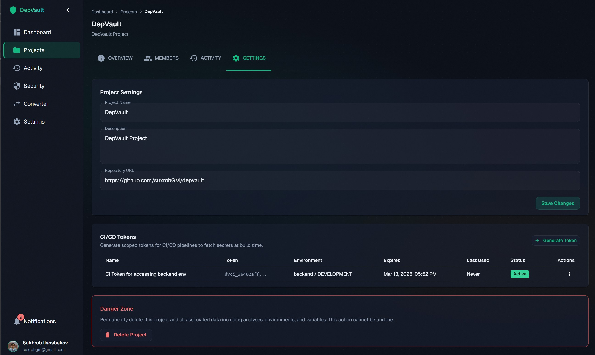
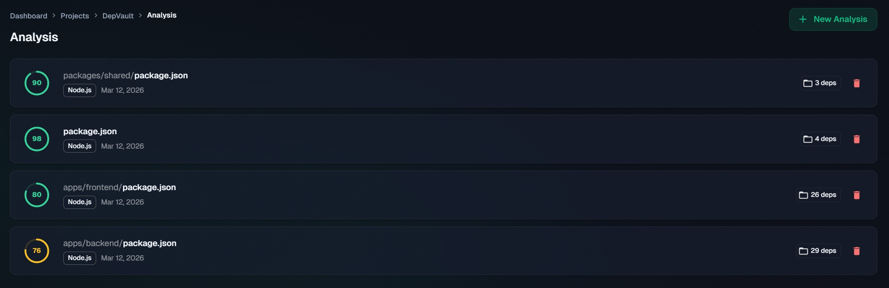
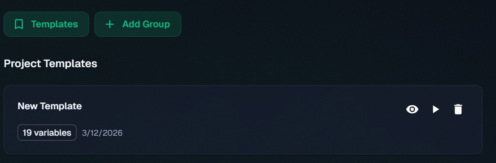
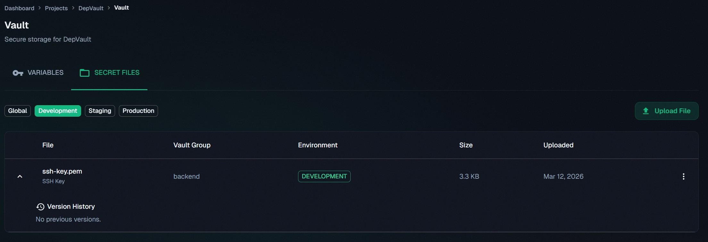
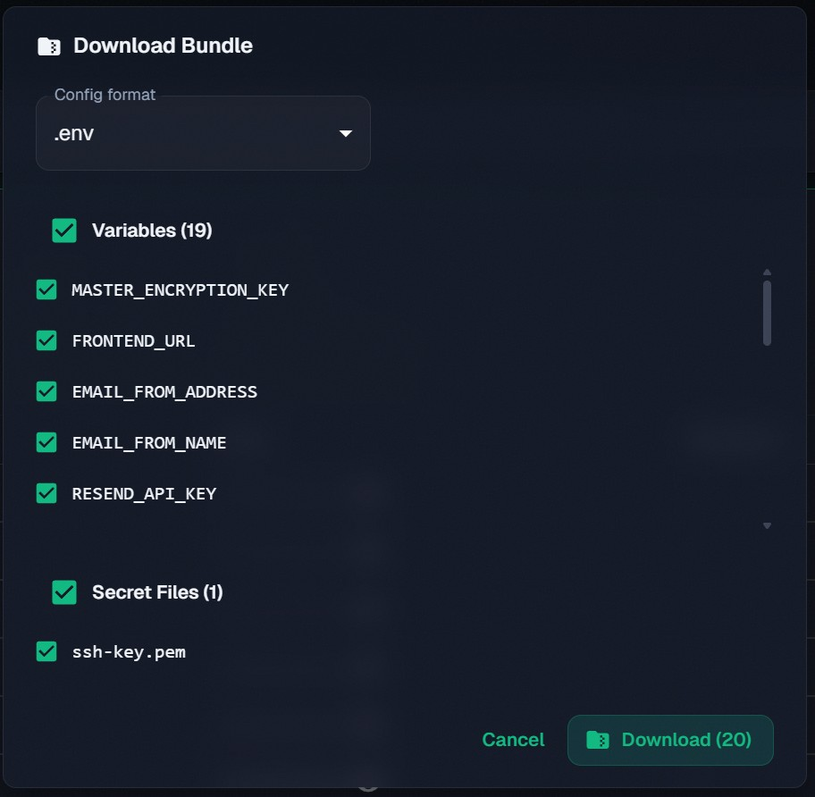
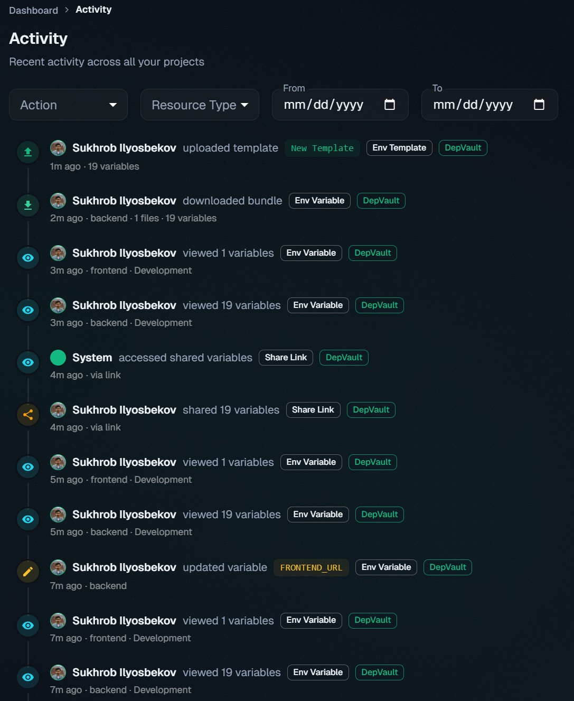

# Screenshots

A visual tour of DepVault organized by feature area. All screenshots are from the production deployment.

---

## Dashboard

The main dashboard showing all projects with health scores, dependency counts, and last analysis dates.

---

## Project Management

### Project Overview

Project detail page with summary cards for dependencies, environments, vulnerabilities, and team members.

### Project Settings

Project configuration including name, description, repository URL, danger zone, and member management.

---

## Dependency Analysis

### Analysis Results

Parsed dependency list showing package names, current and latest versions, update status badges, and vulnerability indicators.

### Vulnerability Details

Expanded view with vulnerability severity ratings, CVE IDs, license information, and health scores per dependency.

---

## Repo Browser

### Config Files

Repo browser for a selected app and environment: config files shown in the Form (key/value) or Raw (CodeMirror) editor, with values masked by default. Each file is one client-encrypted blob.

### File Version History & Diff

Version history for a config file with a git-style diff between any two versions, computed client-side after decrypt, plus restore-to-version.

### Environment Selector

Switch between environment slugs (base, dev, prod, staging, or custom) to browse each app's files for that environment.

---

## Secret Management

### Secret Files

Encrypted file storage showing pushed certificates, keys, and credentials per app at their repo-relative paths, with metadata and download options.

### Share File

One-time encrypted link generation for a config or secret file with configurable expiration and optional password protection; the decryption key lives only in the URL fragment.

### Download Bundle

Encrypted archive download of selected config and secret files for an app + environment as a single .zip bundle.

---

## Security

### Security Dashboard

Aggregated security overview showing vulnerability counts, secret scan status, rotation age indicators, and compliance summary.

---

## CI/CD Integration

### CI Integration

CI/CD pipeline configuration showing how to inject secrets into GitHub Actions and other CI providers using scoped tokens.

### Generate CI Token

Token generation form with environment scope, expiration duration, and optional IP allowlist.

---

## Tools

### Format Converter

Convert between .env, JSON, YAML, and TOML configuration formats with live preview.

---

## Activity

### Activity Log

Chronological feed of project actions including variable changes, file uploads, secret shares, and member updates.

